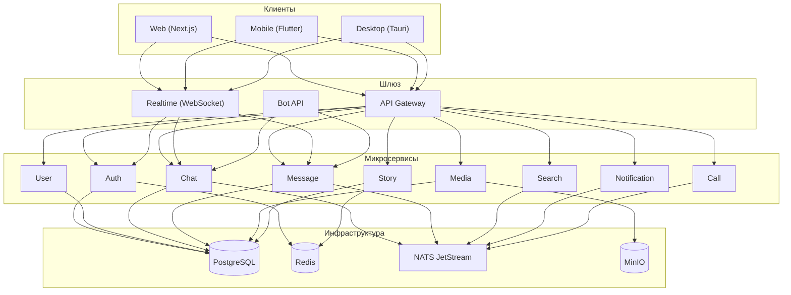
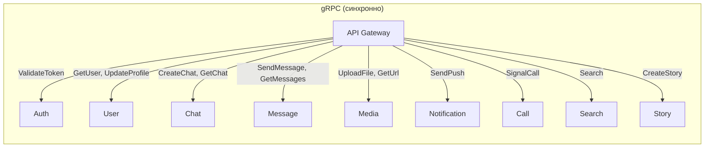
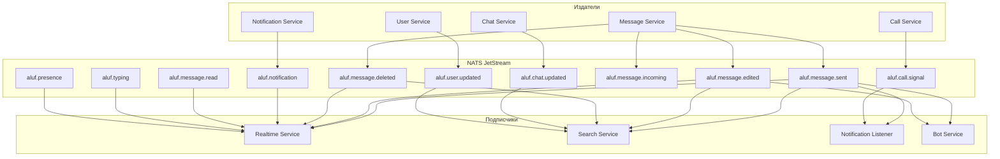
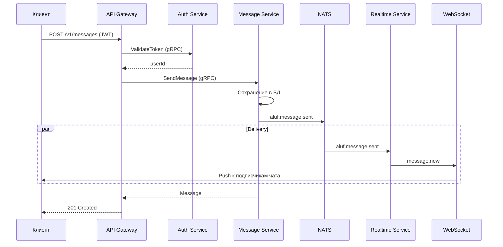
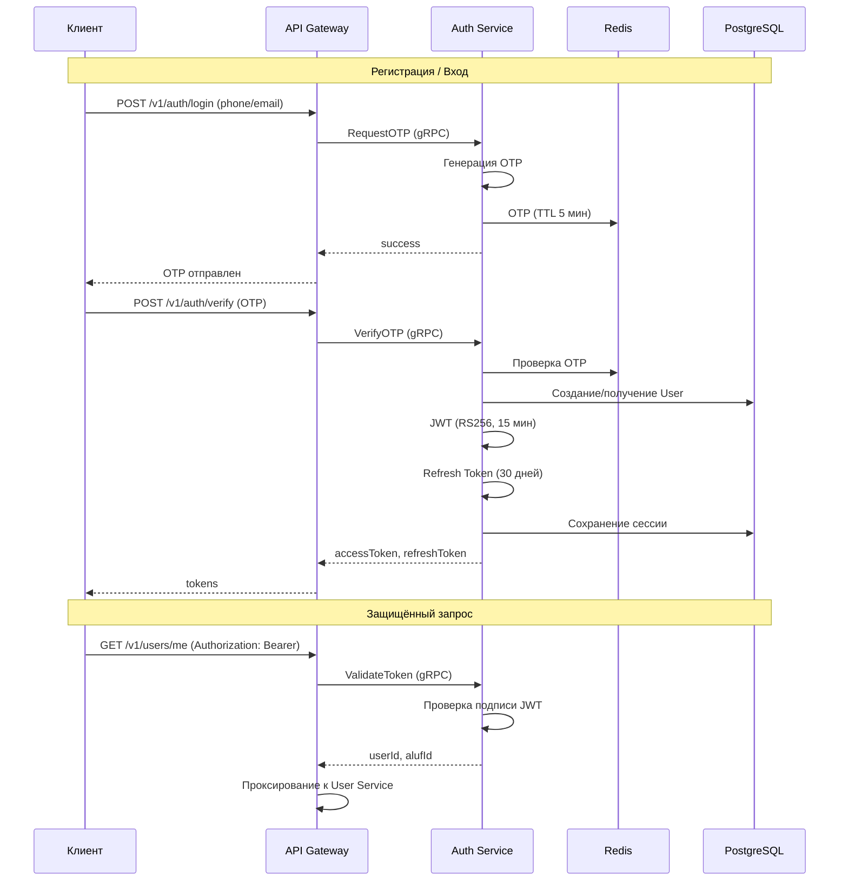
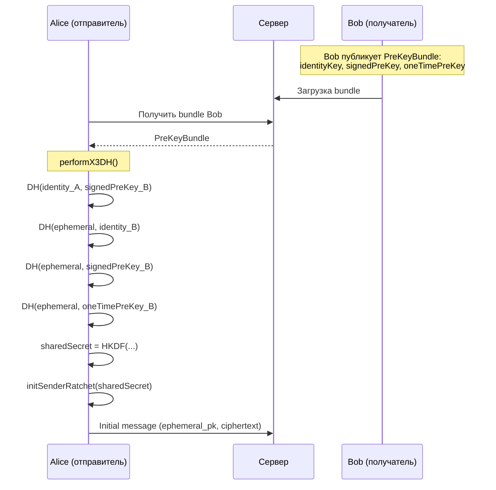
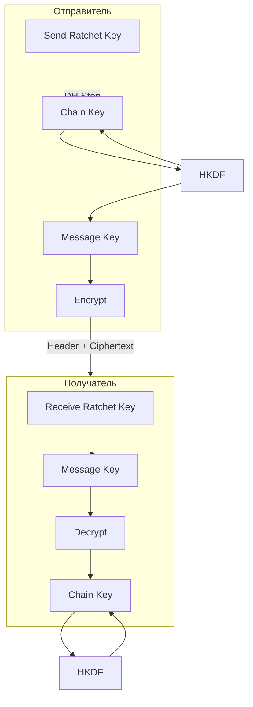
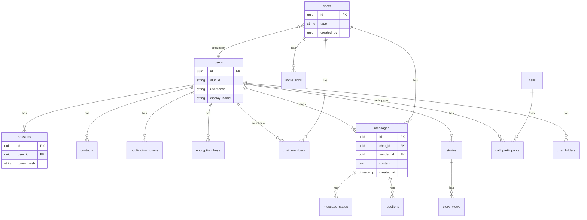

# Архитектура Aluf Messenger

Обзор архитектуры мессенджера Aluf: микросервисы, коммуникация, потоки данных и диаграммы.

## Содержание

- [Обзор системы](#обзор-системы)
- [Микросервисы и коммуникация](#микросервисы-и-коммуникация)
- [Поток данных: отправка сообщения](#поток-данных-отправка-сообщения)
- [Поток аутентификации](#поток-аутентификации)
- [E2EE: Signal Protocol (X3DH + Double Ratchet)](#e2ee-signal-protocol-x3dh--double-ratchet)
- [Схема базы данных](#схема-базы-данных)

---

## Обзор системы

---

## Микросервисы и коммуникация

### Синхронная связь (gRPC)

API Gateway проксирует запросы к backend-сервисам через gRPC:

### Асинхронная связь (NATS JetStream)

События между сервисами и Realtime доставляются через NATS:

---

## Поток данных: отправка сообщения

---

## Поток аутентификации

---

## E2EE: Signal Protocol (X3DH + Double Ratchet)

Секретные чаты используют Aluf Protocol на базе Signal Protocol в пакете `@aluf/crypto`.

### X3DH — установка сессии

### Double Ratchet — обмен сообщениями

### Компоненты E2EE

| Компонент   | Описание                                      |
|-------------|-----------------------------------------------|
| **X3DH**    | Аутентифицированный обмен ключами при первом контакте |
| **Double Ratchet** | Симметричное шифрование с forward secrecy |
| **HKDF**    | Derive ключей из общего секрета               |
| **Curve25519** | ECDH через TweetNaCl (nacl.scalarMult)     |
| **Хранение ключей** | `encryption_keys` в БД (identity, signed prekeys) |

---

## Схема базы данных

### Основные таблицы

| Таблица               | Назначение                          |
|-----------------------|-------------------------------------|
| `users`               | Пользователи, профили               |
| `sessions`            | Сессии (refresh tokens)            |
| `chats`               | Чаты (личные, группы, каналы)       |
| `chat_members`        | Участники чатов                     |
| `messages`            | Сообщения                           |
| `message_status`      | Доставка / прочтение                |
| `encryption_keys`     | E2EE ключи (prekeys)                |
| `stories`             | Истории (24ч)                       |
| `calls`               | Звонки (WebRTC)                     |
| `notification_tokens` | Push-токены (FCM, APNs)              |
